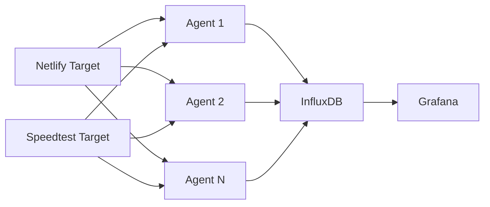

# What this is

A way of monitoring connectivity to the internet from devices on a local network. Also, a hobby project for me to learn Rust.

## History

### V1

Back in 2019, I was getting suspicious about occasional latency from my home network to outside internet and wanted some evidence. So, I created a simple project to try to see if I could "catch it in the act".

The initial setup was a Rust program running on my local network and periodically fetching a remote site on Netlify. This would then be scraped by a Prometheus server.

This worked well enough in that it recorded metrics when it was up and running. However, the machines it ran on were often laptops or other machines which went to sleep and stopped recording. Not great for capturing an occasional problem.

# V2 (current)

Fast-forward to 2022, and the small matter of COVID means I am now spending substantially more time at home, so now am more impacted when there is a network issue. I also have more computers to look after and a bigger local network, so more sources of problems.

I decided InfluxDB was a better fit than Prometheus as the tests I am doing are more event-like and not a continuous stream.

I also wanted to take measurements from around the house because the issues experienced could be local.

This leads to this architecture:

- Netlify Target: this is a simple passive website
- Speedtest Target: this an active member of the <https://www.speedtest.net> network
- Agent 1 ... N: these run on different devices, periodically fetch from the different Targets, and send events to InfluxDB
- InfluxDB / Grafana: a standard setup, running together on a single machine
